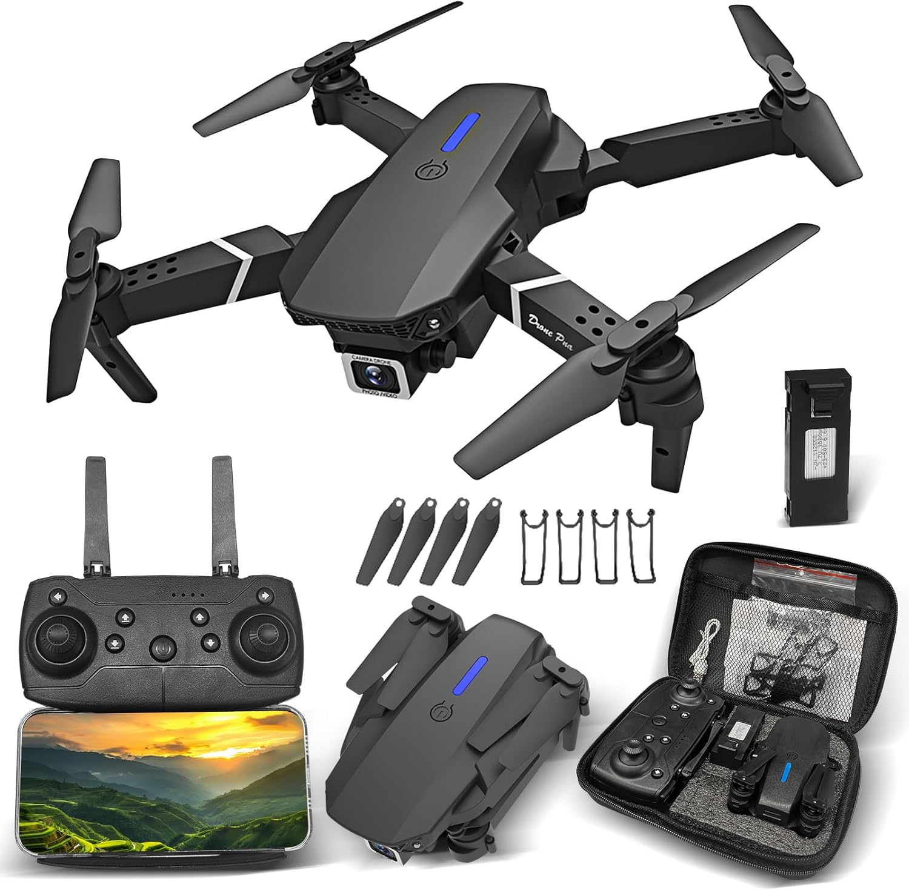

# Hacking Drone E88

Research-grade reimplementation of the WiFi control path for the Holy Stone HS175D / 2BFPZ-E88 drone family.

This repository contains a working Python prototype that can talk directly to the drone over WiFi, without the official mobile app, plus protocol notes collected during reverse engineering.

## Drone



## What Works

- Direct UDP flight-control packets to `192.168.1.1:7099`
- RTSP video access at `rtsp://192.168.1.1:7070/webcam`
- Continuous control loop compatible with the stock app behavior
- Takeoff, land, gyro calibration, camera switch, and manual axis control
- Trim support for drift compensation
- Flight-session text reports with timestamps and RX/TX activity

## Current Scope

This is still a prototype. The repository is useful for:

- reverse engineering and protocol study;
- interoperability experiments;
- basic manual control from a computer;
- future work on computer-vision-assisted autonomy.

What it is not yet:

- a polished pilot app;
- a safe autonomous flight stack;
- a telemetry-rich control system.

The drone does answer on the UDP socket, but the observed RX payload is currently only a minimal link/status packet. In practice, the main external sensor available to the computer is the onboard camera stream.

## Repository Layout

- [drone_controller.py](drone_controller.py) - interactive Python controller prototype
- [PROTOCOL.md](PROTOCOL.md) - project-local protocol notes and findings from live tests
- `wiki/` - copied reference pages from the personal knowledge base that supported this prototype

## Requirements

- Python 3.10+
- A computer connected to the drone WiFi network
- Optional: `ffplay` or VLC for viewing the RTSP stream

## Quick Start

1. Connect your computer to the drone WiFi network.
2. Optionally test the video stream:

```bash
ffplay rtsp://192.168.1.1:7070/webcam
```

3. Run the controller:

```bash
python3 drone_controller.py
```

4. Use the interactive commands shown on screen.

Useful commands:

- `g` - gyro calibration
- `t` - takeoff
- `l` - land
- `h` - hover / neutralize axes
- `w/s` - pitch
- `a/d` - roll
- `q/r` - yaw
- `u/j` - throttle
- `tr+`, `tr-` - roll trim
- `tp+`, `tp-` - pitch trim
- `ty+`, `ty-` - yaw trim
- `tt+`, `tt-` - throttle trim

Example terminal output:

```text
══════════════════════════════════════════════════
  HS175D Drone Controller
  Conecte-se ao WiFi do drone antes de começar!
══════════════════════════════════════════════════
╔══════════════════════════════════════════════════╗
║  HS175D Drone Controller — Comandos              ║
╠══════════════════════════════════════════════════╣
║  t        — Takeoff (decolagem)                  ║
║  l        — Land (pouso)                         ║
║  e        — Emergency Stop                       ║
║  g        — Calibrar giroscópio                  ║
║  h        — Hover (todos eixos neutros)          ║
║  w/s      — Pitch frente/trás                    ║
║  a/d      — Roll esquerda/direita                ║
║  q/r      — Yaw esquerda/direita                 ║
║  u/j      — Throttle sobe/desce                  ║
║  c        — Trocar câmera                        ║
║  p        — Mostrar estado atual                 ║
║  x        — Sair                                 ║
║  ?        — Mostrar esta ajuda                   ║
╠══════════════════════════════════════════════════╣
║  TRIM (compensa drift, persiste entre comandos)  ║
║  tr+/tr-  — Trim roll  (esq/dir)                 ║
║  tp+/tp-  — Trim pitch (frente/trás)             ║
║  ty+/ty-  — Trim yaw   (giro)                    ║
║  tt+/tt-  — Trim throttle (sobe/desce)           ║
║  tr0      — Reset todos os trims                 ║
╚══════════════════════════════════════════════════╝
[INFO] Controlador iniciado -> 192.168.1.1:7099
[INFO] Relatorio de voo -> flight_reports/2026-04-13/flight_12-35-56.txt
```

## Flight Reports

Every run generates a text report under:

```text
flight_reports/YYYY-MM-DD/flight_HH-MM-SS.txt
```

The report includes:

- session start/end;
- commands issued;
- control packets transmitted when state changes;
- heartbeat start;
- UDP packets received from the drone;
- summary counters for TX/RX activity.

## Flight Demo

A short test-flight recording is included below:

media/flight-demo.mp4

Fallback link: [open video file](media/flight-demo.mp4)

## Safety Notes

- Treat this as an experimental controller.
- Fly only in a large, clear, non-crowded environment.
- Keep a finger ready on land or emergency stop.
- Expect drift, inconsistent stabilization, and hard landings.
- Do not test autonomy near people, pets, vehicles, or fragile objects.

## Research Provenance

This prototype was built from:

- static analysis of the official Android app `com.cooingdv.rcfpv`;
- FCC documentation for the `2BFPZ-E88` hardware family;
- live testing against the drone over WiFi;
- protocol validation using generated flight reports.

The copied background pages used during construction live in [wiki/_index.md](wiki/_index.md).

## Status

The basics are in place:

- packet format is reconstructed;
- takeoff/land/gyro flags are validated in practice;
- RTSP video access works;
- trim handling and session logging are implemented.

Next likely steps:

- persist trim presets across runs;
- add safer axis reset behavior around landing;
- integrate video capture into Python;
- build higher-level control experiments on top of the UDP layer.
